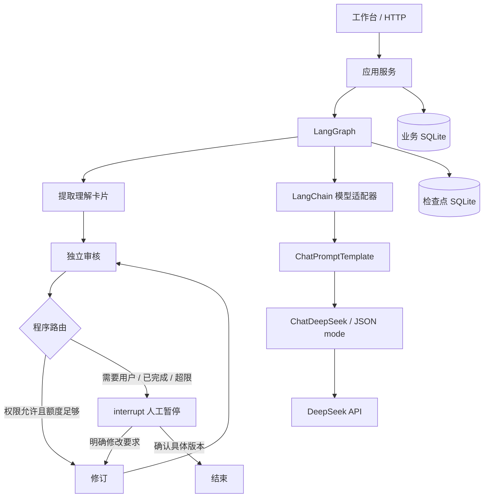

> 当前数据库实现已迁移到 PostgreSQL；下文保留开发历史。最新存储设计见 [PostgreSQL 迁移说明](postgresql.md)。

# 第一轮实现：从业务图到代码框架

## 一次请求的路径

## 为什么这样划分

接口不直接拼提示词，图节点不处理 HTTP。业务数据约定用于校验模型结果；模型适配器可以替换为测试替身；存储负责重启后继续读取已知状态。LangGraph 的检查点与供用户查看的历史剧本分别保存。

本轮采用 SQLite 是单机起步的取舍，不代表最终必须使用 SQLite。一次只执行一个创作操作；前端在请求期间禁止重复提交，服务端还会验证版本与暂停编号。

## 数据约定与局限

输入包含 story、mode、constraints。理解卡片覆盖十个维度，每个维度保存 text/source/evidence。source 可为 original、user、ai_suggestion、unknown。

审核问题保存类型、说明、建议、needs_user 和原文引用。程序生成问题编号并绑定版本；相同类型与同一组引用得到相同编号。语义相同但引用不同的问题仍可能得到新编号，因此本版没有启用“连续两轮无进展”自动判断。

每次修订新增剧本版本；原稿不变。只有 reviewed_version 等于当前版本才能确认，防止拿旧审核结果确认新剧本。审核引用不存在的文本时，当前执行失败，不把它解释为无问题。

创作约束的语义判断仍来自模型。程序能强制让已识别的约束问题进入人工处理，但不能保证模型发现所有违约内容。

## 暂停、配额与错误

人工暂停节点在 interrupt 前不调用模型、不写业务数据，避免恢复节点从头执行时重复产生外部动作。

调用前先在业务库预占配额，失败也计数，SDK 的 max_retries=0，网络错误不自动重试。提取卡片的来源引用校验失败时，业务层最多纠正一次，仍占用累计调用额度。项目累计修订上限为三次，调用上限为十次，不代表人民币预算。图 recursion_limit=40 是额外技术保险，不是业务轮数。

旧 /tasks 模拟视频接口被替换为 /api/projects、项目读取、versions 和 resume。此项目还未对外提供兼容性承诺，因此没有保留旧 API。静态 Swagger 资源沿用本地副本，避免 CDN 白屏。

## 下一次由你主导的设计问题

1. 十维卡片何时拆成具有稳定编号的人物、道具、事件？
2. 协作模式如何展示多个候选方案，以及逐项接受？
3. 执行中断恢复、后台任务和调用预算怎样一起设计？
4. 用哪些人工标注案例衡量审核器的查准率与查全率？

本轮只验证最小闭环，不视为整个第一阶段功能已经完成。

## LangChain 接入版

已实现 FastAPI + Pydantic + LangGraph + LangChain（langchain-core、langchain-deepseek）+ SQLite。
LangChain 采用官方独立集成包，不必为了名称安装未使用的顶层 langchain 包。

provider.py 使用 ChatPromptTemplate 组织系统消息和用户材料，通过 LCEL 的管道运算符连接 ChatDeepSeek.with_structured_output(method="json_mode", include_raw=True)。保留原始响应，以检查结束原因并记录 token 用量。JSON 模式不保证业务 schema 正确：workflow.py 继续执行 Pydantic 和逐字引用检查。

框架分工：LangChain 负责模型交互；LangGraph 负责状态和循环；service/domain/storage 负责业务约束与持久化。httpx 只作为 SDK 的底层传输和离线测试注入点，应用不再手写 HTTP 请求。

验证使用真实 ChatDeepSeek 适配器连接 MockTransport，覆盖消息格式、JSON 模式、token 计量、429 不重试、截断及错误脱敏；本次迁移未向外部模型发送故事。尚未验证迁移后真实供应商联调。

PostgreSQL、SQLAlchemy、Alembic、RAG/pgvector、Redis/Celery、LangSmith 和 Docker/CI 是后续阶段，尚未实现。LangSmith 的依赖存在不等于已配置追踪。

官方参考：https://docs.langchain.com/oss/python/integrations/providers/deepseek

## 流式工作台

网页使用 POST /api/projects/stream 和 POST /api/projects/{id}/resume/stream，通过 fetch ReadableStream 读取 SSE。事件包括 project、stage、delta、result、error，空闲期间发送心跳。模型层采用 ChatDeepSeek 的 stream() 与 JSON mode，累积完成后严格解析 JSON，再交给现有业务校验。非流式接口继续保留。

实时 JSON 是未校验预览，不代表已通过审核，也不是模型思维链。中途失败仍保存失败状态，不把半成品写成正式卡片。请求级 ContextVar 把通知带入 LangGraph 节点，SSE 桥使用有界队列避免无限缓存。浏览器断开后任务继续执行并保存，重连通过项目编号读取最终状态，不重放逐字事件；没有取消按钮。服务进程退出会中断任务，当前不提供后台队列级可靠性。

本轮以模拟供应商 SSE 验证分块拼接，以接口测试验证流式创建、保存和恢复；没有外发故事做付费联调。

## 自由编剧 Agent Loop（2026-09-22）

free 入口：plan → compose → review → decide → revise/review 循环或 human 暂停。plan 保存 outline，compose 保存首个完整剧本，用户最初输入保存在 original_story，不被覆盖。协作及旧忠于原稿入口仍走 extract，原稿直送视频平台尚未接入。

普通创作空白由自由编剧自行补全。审核器只有在明确约束冲突或越过授权边界时标 needs_user；自由模式允许自动修复可解决的 constraint 问题，但确认接口仍禁止带着约束问题确认。此判断依赖模型，不保证语义正确。审核无问题后等待用户确认，不自动付费生成视频。

保留累计3轮修订和10次调用。自由模式基础3次请求，完成3轮修订最多9次。每次审核比较已有问题编号集合，连续两次旧问题全部仍存在（允许增加新问题），停止为 no_progress；编号由类别和逐字证据构成，不是语义评测，证据改写可能无法识别。用户给出新方向可在剩余额度内恢复，重置停滞计数但不重置调用或修订次数。

验证：标题先构思再编写；重复问题停止；可修复约束自动处理；明确需用户的问题暂停；变动问题在3轮上限停止；旧流程回归。全部采用模拟模型，无付费真实联调。

## 编剧模块完整交互版（2026-09-22）

本节及 writer-module.md 更新前文早期方案：协作提取包含 input_kind，非完整输入路由 brainstorm → direction_choice（interrupt）→ compose → review；完整稿 extract → review。自由模式 plan → compose → review/decide/revise 不变。原稿直接交接在应用层保存和导出，跳过图调用。

ResumeProject 新增 choose、clarify，逐条 IssueDecision（adopt/replace/keep）。应用服务核对模式、版本、暂停编号、方向编号和建议编号；resolve_decisions 在服务端还原原建议并组成 revision_instructions。human 节点收到 clarify 只走 review，收到 revise 走 revise/review。

protected_issues 保留未选择的旧问题；decision_history 保存来源版本、操作和最终授权。只澄清时不创建正文版本，复审仍受额度控制。diff/export 是只读派生输出；retry 只允许 failed 状态、剩余额度和可恢复检查点，从原线程失败节点继续。

前端不再拿“接受现状”的勾选替代“采用建议”。候选方向、逐条选择、整体补充、仅澄清和确认各自有明确提交入口。接口和浏览器集成均使用模拟供应商验证，真实效果仍需评测。

## PostgreSQL 持久化（2026-09-23）

业务表使用 SQLAlchemy 与 Alembic；状态快照使用 JSONB。图检查点改为 PostgresSaver，独立连接池。SQLite 仅供离线旧库导入，运行时不再支持回退。调用预算用项目行锁保证跨连接原子预占；应用仍保留进程内操作锁并要求单进程部署。
