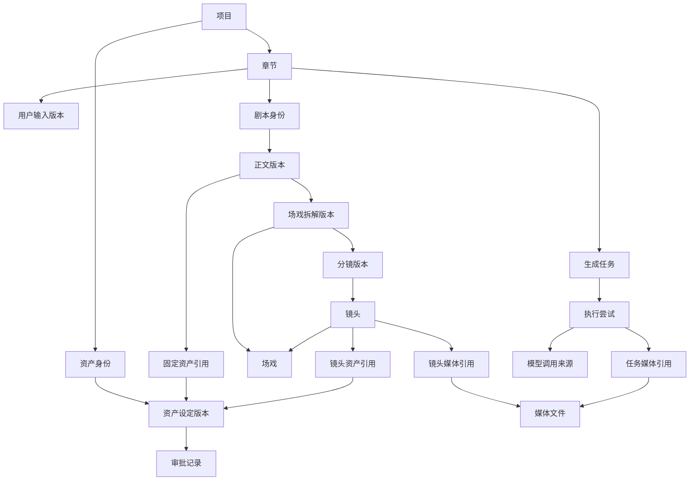

# 数据库领域基础与后续接入

## 实施范围

新增32张领域表：作品/章节/输入及正文版本、资产及审批引用、审核决策、任务尝试与调用来源、场戏拆解/分镜/镜头/媒体关联。旧 fp_projects、fp_versions、fp_calls 和 LangGraph 检查点保留。

旧编剧入口通过事务内兼容桥写入默认章节、用户输入和正文版本；旧 workflow 的 snapshot 和 fp_versions 暂为该入口权威。桥接是单向的，不允许把新流程写入的当前版本静默覆盖。未来多章节服务须使用独立执行标识，不能复用旧项目 thread_id 处理多章。

目前尚未接通：章节/资产/镜头管理界面、这些对象的完整 CRUD 服务、审批交互、生成任务队列、媒体上传和视频平台。资产内部 JSONB 设定、场戏内容、镜头内容等应用级细项须在对应模块用带 schema_version 的 Pydantic 数据约定落实；现阶段已锁定关系与版本边界，不能宣称全部模型输出校验已实现。

## 核心关系

## 已落实的数据库规则

- 多数业务关联携带 project_id，以组合外键阻止跨项目串联；相同资产不同版本也验证身份归属。
- 版本号为所属对象内正整数并唯一。正文版本必须指向同一剧本的上一版；当前版本指针必须属于当前剧本。
- 版本内容和历史引用禁止 UPDATE/DELETE；资产和项目名称可独立修改。当前无“已封版集合”状态，所以组成集合的追加写入仍须由后续服务限制到创建该版本的事务，不能把现有约束解释成对所有后续 INSERT 的完整封版。
- 章节独有资产无法用于其他章节；缩小共有资产范围时检查已有引用。场戏和镜头资产引用也追溯到章节。
- 正文/场戏/镜头的正式资产引用要求已批准版本；审批追加保存，用数据库顺序号判断最新决定，不依赖同一事务里可能相同的时间戳。撤销不会删除旧引用。
- 任务请求、来源剧本、目标镜头归属章节需一致；任务输入建立后不可覆盖，任务状态可以更新。
- 镜头必须属于分镜采用的那版场戏拆解；媒体是独立文件元信息，关联不复制文件。任务媒体关联可追溯输入/输出来源。
- 不可变历史只允许增加新版本。已存在领域数据时拒绝回退到删除领域表的迁移，避免误删。

## 迁移与兼容

执行 `.\.venv\Scripts\python.exe -m scripts.init_db` 显式升级。0002 建表、约束和触发器；0003 冻结回填算法，为旧项目建立默认章节，保存原稿与每版正文，保持原ID、调用额度和检查点不变。回填时间是导入时间，不能冒充旧版本实际创作时间。

未来重复 initialize 不会重复回填；正常旧入口写入即时同步；SQLite 导入也在原事务内调用兼容桥。出现历史内容冲突时拒绝写入，而不是覆盖。

必须先备份，并用 `python -m scripts.verify_domain_backup <before.dump>` 在随机临时库恢复演练。正式迁移前停止应用写入；升级后比较原六张业务/检查点表指纹。恢复备份应先还原到新库并切换配置，不覆盖唯一副本。

## 接下来实施顺序

1. 项目列表、命名、归档、点击继续创作，替代手工输入长编号。
2. 章节与资产 CRUD，确立 JSONB 的分类型 Pydantic 校验、并发版本分配、确认引用事务和归档规则。
3. 让新版编剧流程按章节运行，逐步替代旧入口；接通审核和任务来源记录。
4. 场戏拆解、分镜编辑、媒体存储与生成平台。

这次数据库基础为这些模块提供落点，不会自动使它们上线。新增字段仍通过 Alembic 演进；不承诺数据库永不修改。
